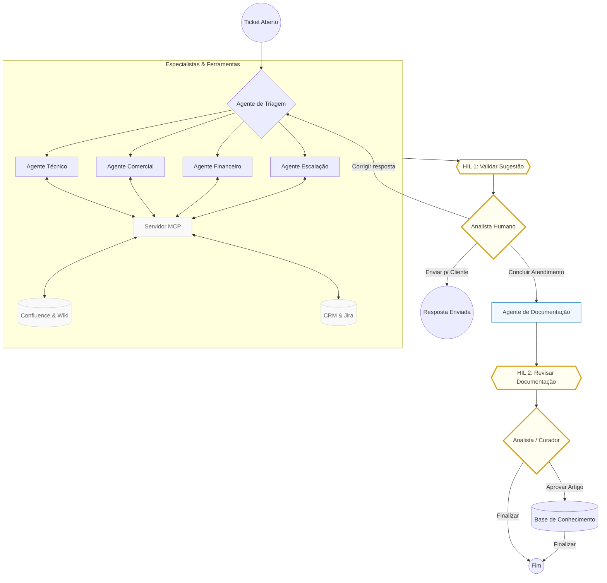
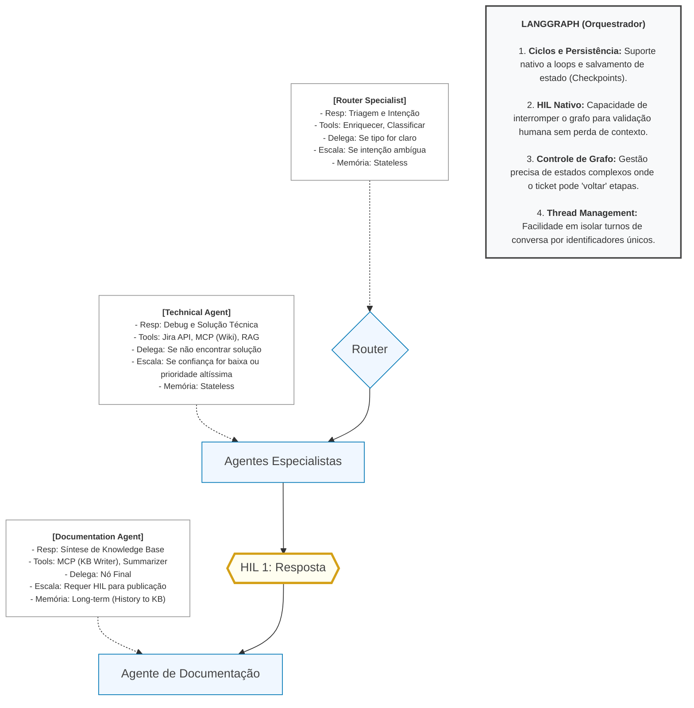

# Customer Success AI

## Resumo

**Customer Success AI** é um MVP de sistema **multiagentes** voltado a **triagem de tickets**, **recuperação de contexto** a partir de uma base de conhecimento e **geração de respostas** com especialistas por categoria (técnica, comercial, financeira, escalação). O fluxo inclui **revisão humana (HIL)**, memória de feedback sobre execuções anteriores e caminho opcional para **geração e publicação de artigos** na Base de Conhecimento (KB). A integração com dados externos passa por um **servidor MCP** que encapsula chamadas a APIs soluções externas.

O projeto nasceu no contexto de um time de **Customer Success** (B2B SaaS), mas o padrão — triagem → RAG → agente especializado → HIL — aplica-se a outros domínios de atendimento ou operações com fila de casos e documentação interna.

---

## Definição do problema e público-alvo

### Problema

Times de sucesso do cliente e suporte lidam com alto volume de tickets heterogêneos; classificar, priorizar e responder com consistência exige tempo e conhecimento tribal espalhado em documentos. O objetivo deste MVP é **reduzir o tempo até uma resposta confiável**, **uniformar o uso da base de conhecimento** e **sinalizar quando a intervenção humana é obrigatória** (por exemplo, cliente com múltiplos tickets abertos ou baixa confiança do modelo).

### Público-alvo

- **Squads de Customer Success / CS Ops** que querem prototipar assistência ao analista mantendo o humano no loop.
- **Engenheiros e arquitetos** que buscam uma referência mínima mas completa: grafo de agentes, MCP, APIs mock e observabilidade.
- **Equipes internas de produto** que podem reutilizar o fluxo para outros “tipos de cliente” ou filas (Professional Services, Onboarding, N2/N3), ajustando categorias, prompts e fontes de dados.

---

## Arquitetura utilizada

Visão em camadas:



Detalhamentos:



1. **CLI** (`src/customer_success_ai/cli.py`): carrega configuração, orquestra (opcionalmente) o **mock HTTP** e o **servidor MCP**, depois invoca o grafo LangGraph.
2. **App mock (FastAPI)** (`src/app_mock/main.py`): expõe as rotas HTTP que simulam o CRM/tickets e a KB para desenvolvimento; lê arquivos em `mocks/`.
3. **Backend MCP** (`src/customer_success_ai/mcp_backend/server.py`): expõe ferramentas estáveis para utilização dos agentes
4. **Grafo LangGraph** (`src/customer_success_ai/workflow/graph.py`): consulta histórico (sensibilidade do cliente), **triagem** LLM, **RAG**, **especialista** por categoria, **HIL**, e ramos de geração/validação de KB quando aplicável.
5. **Persistência**: checkpoints do grafo em SQLite (`langgraph-checkpoint-sqlite`); runs e feedback em SQLite (`storage/sqlite.py`).

---

## Ferramentas e técnicas aplicadas

| Área | Tecnologia / técnica |
|------|----------------------|
| Orquestração de agentes | **LangGraph** (StateGraph, rotas condicionais, checkpointing) |
| LLM | **LangChain** + **langchain-openai** (triagem e especialistas) |
| RAG | **langchain-huggingface** + **FAISS** + **Re-ranking** + **Filtro por Metadados** |
| Contrato com ferramentas | **MCP** (`mcp`, `FastMCP`, `HTTP streamable`) |
| APIs mock e HTTP | **FastAPI**, **Uvicorn** |
| Configuração | **python-dotenv**, variáveis de ambiente (`.env`) |
| Observabilidade | **JSONL** por execução (`JsonlLogger`), tempos por passo (`StepTimer`), logs do servidor MCP em arquivo |
| Dados locais | **SQLite** (runs, checkpoints e feedbacks) |
| Formato KB | Markdown com **frontmatter YAML** (`PyYAML`) |

Técnicas de produto/ML: **triagem estruturada** (JSON), **citações** para rastreabilidade, **limiar de confiança** e regras de negócio (ex.: tickets “vivos” do mesmo cliente aumentam sensibilidade), **HIL** interativo ou por flags de CLI para testes automatizados.

---

## Mocks, dados de apoio e APIs HTTP criadas para eles

Para **testar sem sistemas reais**, o repositório inclui dados estáticos e um servidor que os expõe por HTTP.

### Arquivos de mock (pasta `mocks/`)

| Recurso | Caminho | Descrição |
|---------|---------|-----------|
| Histórico de tickets | `mocks/tickets/tickets_historico_mock.json` | Lista JSON de tickets (mesmo formato esperado pela API `GET /tickets/historico`). |
| Base de conhecimento | `mocks/base_conhecimento/*.md` | Artigos em Markdown com frontmatter (`id`, `title`, `category`, `tags`, etc.). |
| CRM (dados complementares) | `mocks/crm/crm_mock.json` | Clientes e contratos de exemplo; útil para **cenários enriquecidos**. |

### API HTTP unificada (FastAPI)

Em desenvolvimento local, quando `TICKETS_API_URL` aponta para `localhost` / `127.0.0.1`, o CLI pode **subir esse app automaticamente** via `integrations/tickets_mock_spawn.py` (desligável com `TICKETS_MOCK_AUTOSTART=0` se você já tiver a API rodando).

### Relação com o MCP

O cliente de integração usado pelo grafo (`integrations/loader.py`) chama ferramentas MCP (`kb.search`, `tickets.history`, `kb.create_doc`, …), e o servidor MCP repassa às URLs HTTP configuradas. Assim, **os mesmos mocks** alimentam tanto chamadas diretas à API quanto o caminho MCP.

---

## Como adaptar a outros contextos

1. **Domínio e categorias**: ajuste `ALLOWED_CATEGORIES` e modelos em `triage/models.py`, prompts em `triage/router.py` e `agents/specialists.py` (ex.: “logística”, “jurídico”, “RH” em vez de CS).
2. **Contrato de ticket**: mantenha a estrutura esperada no estado (`workflow/state.py`) ou estenda com campos novos e atualize triagem, RAG e prompts.
3. **Fontes de verdade**: substitua ou complemente `app_mock` por APIs reais; preserve as bases `TICKETS_API_URL` e `KB_API_URL` ou estenda o MCP com novas ferramentas.
4. **Base de conhecimento**: troque os `.md` em `mocks/base_conhecimento` ou aponte `KB_MOCK_DIR` / backend real com os mesmos endpoints conceituais (`/search`, `/docs`).
5. **Sensibilidade e regras**: edite `workflow/graph.py` (ex.: como contar tickets abertos, limiares de confiança).
6. **RAG**: adapte `rag/retriever.py` (queries, modelo de embedding, tamanho de contexto).

---

## Como executar

### Pré-requisitos

- **Python 3.12+**
- Chave **OpenAI** (`OPENAI_API_KEY`) para triagem, especialistas e partes do pipeline que usam o modelo configurado no código.

### Instalação

Na raiz do repositório:

```bash
pip install -r requirements.txt
```

Para instalar o pacote em modo editável (opcional, expõe o comando `customer-success-ai`):

```bash
pip install -e .
```

### Comandos principais

A partir da raiz do repo, com `PYTHONPATH` apontando para `src` **ou** com o pacote instalado:

```bash
# Fluxo completo com ticket pré-determinado (sobe mock local + MCP local se URLs forem localhost e autostart estiver ativo)
python -m customer_success_ai.cli run

# Fluxo completo (interativo + determinando o cliente e problema a ser analisado)
python -m customer_success_ai.cli run --cliente "Nome do Cliente" --descricao "Descrição do problema (ticket)"

# Human-in-the-loop interativo (padrão quando não passa --hil)
python -m customer_success_ai.cli run --hil interactive

# Modos não interativos (úteis para smoke tests / CI)
python -m customer_success_ai.cli run --hil aprovar --gerar-kb sim --validar-kb aprovar
python -m customer_success_ai.cli run --hil rejeitar
python -m customer_success_ai.cli run --hil corrigir --correcao "Texto da correção"
```

Apenas o servidor MCP (útil para depuração ou quando o mock já está no ar):

```bash
python -m customer_success_ai.cli mcp
```

### Só o mock HTTP (sem grafo)

Se quiser subir apenas a API FastAPI de tickets + KB (por exemplo, para testar com curl):

```bash
cd src
uvicorn app_mock.main:app --host 127.0.0.1 --port 8001
```

Ajuste porta e paths conforme seu `.env` (`TICKETS_API_URL`, `KB_API_URL`).

---

## Configuração do ambiente

Crie um arquivo `.env` na raiz (use `.env.example` como referência).

| Variável | Obrigatória | Descrição |
|----------|-------------|-----------|
| `OPENAI_API_KEY` | Sim | Chave da OpenAI. |
| `MCP_URL` | Sim | URL do endpoint MCP streamable, ex.: `http://127.0.0.1:8005/mcp`. |
| `TICKETS_API_URL` | Sim | Base da API de tickets, ex.: `http://127.0.0.1:8001/tickets` |
| `KB_API_URL` | Não | Base da KB, ex.: `http://127.0.0.1:8001/kb`. Se omitida, é derivada do host de `TICKETS_API_URL` trocando o path para `/kb`. |
| `MCP_AUTOSTART` | Não | `1` (padrão) sobe o MCP em localhost; `0` se você já tiver o processo rodando. |
| `TICKETS_MOCK_AUTOSTART` | Não | `1` (padrão) sobe o `app_mock` em localhost; `0` se a API já estiver ativa. |
| `LOG_DIR` | Não | Diretório de logs (padrão: `.logs`). |
| `LOG_LEVEL` | Não | Nível de log (ex.: `INFO`). |
| `MCP_SERVER_LOG` | Não | Nome do arquivo de log do servidor MCP (padrão: `mcp-server.log` dentro de `LOG_DIR`). |
| `MOCKS_DIR` | Não | Referência a pasta de mocks no app (padrão: `mocks`); usado no bootstrap de logging/config. |
| `RUNS_DB_PATH` | Não | SQLite de runs (padrão: `.data/runs.sqlite`). |
| `CHECKPOINTS_DB_PATH` | Não | SQLite de checkpoints LangGraph (padrão: `.data/checkpoints.sqlite`). |
| `TICKETS_MOCK_JSON` | Não | Só no processo `app_mock`: JSON alternativo de histórico. |
| `KB_MOCK_DIR` | Não | Só no processo `app_mock`: pasta alternativa de artigos `.md`. |

Após configurar, uma execução típica gera:

- **Log estruturado**: `{LOG_DIR}/customer-success-ai.jsonl`
- **Log do MCP**: `{LOG_DIR}/{MCP_SERVER_LOG}`
- **Bancos**: runs e checkpoints nos paths acima

---

## Licença e contribuições

Este repositório é um MVP experimental; ajuste licença e governança conforme a política da sua organização.
